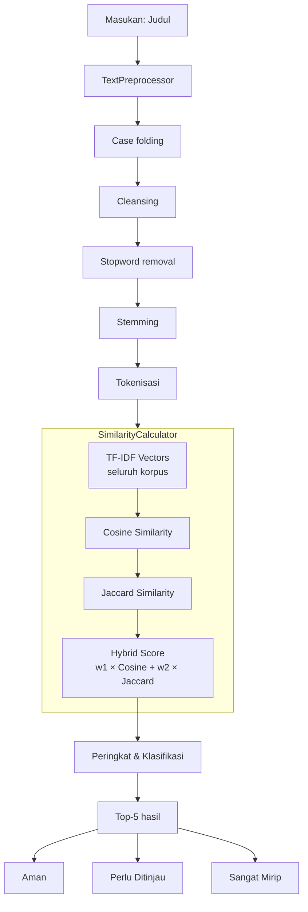
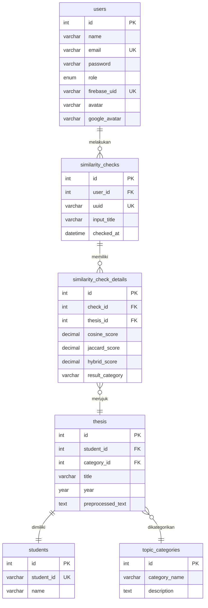

# Leksika — Pengecekan Orisinalitas Judul Skripsi

**Leksika** adalah sistem berbasis web untuk mendeteksi tingkat kemiripan antar judul skripsi menggunakan algoritma _hybrid TF-IDF Cosine Similarity_ dan _Jaccard Similarity_. Dikembangkan sebagai bagian dari penelitian di Program Studi Teknik Informatika, Universitas Malikussaleh.

---

## Latar Belakang

Pertumbuhan jumlah judul skripsi di lingkungan akademik meningkatkan risiko kemiripan antar judul yang dapat mengarah pada duplikasi atau plagiarisme. Diperlukan suatu sistem yang mampu mengukur tingkat kemiripan secara kuantitatif dan objektif menggunakan pendekatan _text mining_ dan perhitungan similaritas teks.

## Algoritma

Sistem menerapkan tiga metode perhitungan similaritas yang dikombinasikan secara hybrid:

### 1. Pra-Pemrosesan Teks

Sebelum perhitungan similaritas, teks melalui lima tahap pra-pemrosesan:

1. **Case folding** — konversi seluruh karakter menjadi huruf kecil (*lowercase*)
2. **Cleansing** — penghapusan tanda baca, angka, dan karakter khusus
3. **Tokenisasi** — pemisahan teks menjadi token/kata individual
4. **Stopword removal** — penghapusan kata umum tidak bermakna menggunakan Sastrawi
5. **Stemming** — pengembalian kata ke bentuk dasarnya menggunakan Sastrawi

### 2. TF-IDF (*Term Frequency — Inverse Document Frequency*)

TF-IDF adalah metode pembobotan yang merepresentasikan setiap dokumen sebagai vektor dalam ruang _terms_.

**Definisi:**

$$TF(t, d) = \frac{\mathrm{count}(t, d)}{\mathrm{total\_terms}(d)}$$

$$IDF(t) = \log\frac{N}{\mathrm{df}(t)}$$

$$TF\text{-}IDF(t, d) = TF(t, d) \times IDF(t)$$

Dimana:
- $N$ = jumlah total dokumen dalam korpus
- $df(t)$ = jumlah dokumen yang mengandung term $t$

### 3. Cosine Similarity

Similaritas kosinus mengukur kemiripan antara dua vektor TF-IDF berdasarkan sudut antar vektor dalam ruang _n_-dimensi.

**Definisi:**

$$\mathrm{Cosine}(A, B) = \frac{A \cdot B}{\|A\| \times \|B\|}$$

Nilai berkisar antara 0 (tidak mirip) hingga 1 (identik). Metode ini menangkap kemiripan semantik berdasarkan distribusi kata dalam dokumen.

### 4. Jaccard Similarity

Similaritas Jaccard mengukur kemiripan berdasarkan irisan dan gabungan dua himpunan token.

**Definisi:**

$$\mathrm{Jaccard}(A, B) = \frac{|A \cap B|}{|A \cup B|}$$

Metode ini menangkap kemiripan leksikal berdasarkan kata-kata yang sama-sama muncul di kedua dokumen.

### 5. Skor Hybrid

Skor akhir merupakan kombinasi linear dari Cosine Similarity dan Jaccard Similarity:

$$\mathrm{Hybrid} = w_1 \times \mathrm{Cosine} + w_2 \times \mathrm{Jaccard}$$

Bobot $w_1$ dan $w_2$ dapat dikonfigurasi oleh administrator melalui panel pengaturan threshold. Nilai default: $w_1 = 0{,}60$ (cosine), $w_2 = 0{,}40$ (jaccard).

## Klasifikasi Hasil

Berdasarkan skor hybrid, sistem mengklasifikasikan hasil ke dalam tiga kategori:

| Kategori | Rentang Hybrid | Interpretasi |
|----------|---------------|--------------|
| **Aman** | < $t_r$ | Judul cukup berbeda dan aman digunakan |
| **Perlu Ditinjau** | $t_r$ – $t_s$ | Terdapat kemiripan yang perlu ditinjau |
| **Sangat Mirip** | $\geq t_s$ | Judul memiliki kemiripan tinggi, disarankan revisi |

Dimana $t_r$ adalah _review threshold_ (default 0,40) dan $t_s$ adalah _similar threshold_ (default 0,75). Kedua ambang batas dapat disesuaikan oleh administrator.

## Arsitektur Sistem



## Dataset

Dataset judul skripsi yang digunakan dalam sistem merupakan data riil dari mahasiswa Program Studi Teknik Informatika Universitas Malikussaleh, mencakup 481 judul skripsi dari berbagai kategori topik, antara lain:

- Kecerdasan Buatan
- Pengembangan Web
- Data Mining
- Sistem Informasi
- Internet of Things
- Jaringan Komputer
- Mobile
- Keamanan Informasi

## Teknologi

| Komponen | Teknologi |
|----------|-----------|
| Bahasa Pemrograman | PHP 8.2 |
| Framework | CodeIgniter 4.7 |
| Basis Data | MySQL 8 / MariaDB |
| Autentikasi | Firebase Authentication |
| Text Mining | Sastrawi (stemming Bahasa Indonesia) |
| Server | FrankenPHP / Nginx + PHP-FPM |
## Instalasi dan Inisialisasi

Ikuti langkah-langkah berikut untuk menjalankan program Leksika di lingkungan lokal Anda:

### 1. Prasyarat
Pastikan sistem Anda sudah terpasang:
* **PHP >= 8.2** (pastikan ekstensi `intl`, `mbstring`, `curl`, `json` aktif)
* **Composer** (manajer dependensi PHP)
* **MySQL / MariaDB**

### 2. Pemasangan Dependensi
Unduh semua pustaka PHP yang dibutuhkan dengan perintah:
```bash
composer install
```

### 3. Konfigurasi Lingkungan (.env)
1. Salin berkas `.env.example` menjadi `.env`:
   ```bash
   cp .env.example .env
   ```
2. Buka berkas `.env` lalu sesuaikan konfigurasi basis data Anda (`database.default.database`, `database.default.username`, dll).
3. Masukkan kredensial Firebase Authentication proyek Anda pada bagian Firebase.
4. Letakkan berkas kredensial privat Firebase Admin SDK (dalam format JSON) ke direktori root proyek dan pastikan namanya sesuai dengan nilai variabel `FIREBASE_CREDENTIALS` di `.env` (default: `firebase-credentials.json`).

### 4. Setup Basis Data dan Seeding
Jalankan migrasi tabel dan seeding data dummy awal (seperti akun administrator, mahasiswa, kategori, dan dataset judul skripsi pembanding):
```bash
# Membuat struktur tabel basis data
php spark migrate

# Memasukkan data awal & data judul skripsi
php spark db:seed DatabaseSeeder
```

### 5. Prapemrosesan Judul Awal
Karena skripsi yang diimpor melalui seeder perlu diproses terlebih dahulu untuk menghitung similaritas kosinus secara instan, jalankan perintah pra-pemrosesan awal:
```bash
php spark app:preprocess-existing
```

### 6. Jalankan Server Lokal
Nyalakan server pengembangan lokal:
```bash
php spark serve
```
Buka peramban (*browser*) dan akses halaman di `http://localhost:8080`.

## Struktur Database



## Lisensi

Proyek ini dilisensikan di bawah **MIT License**.

---

<p align="center">
  Tim I
</p>
