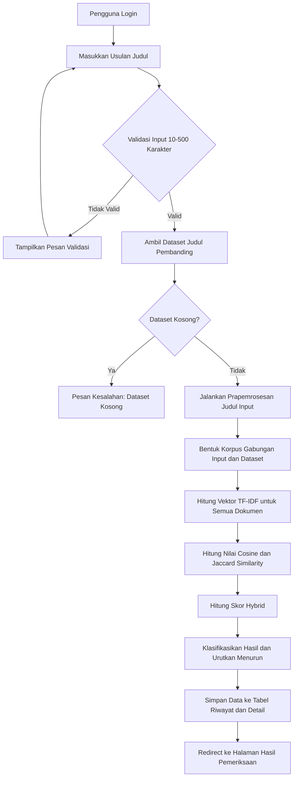
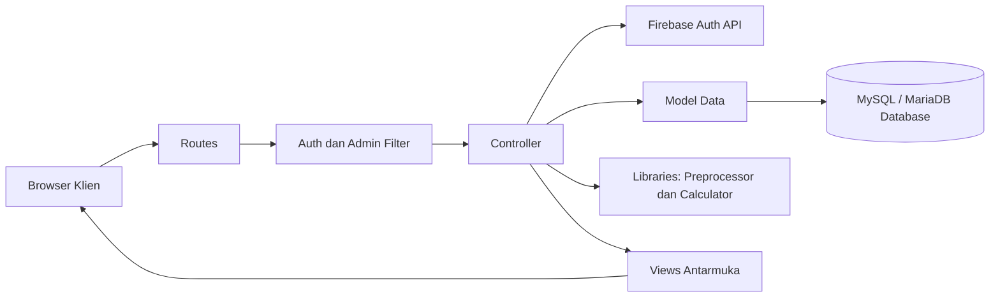
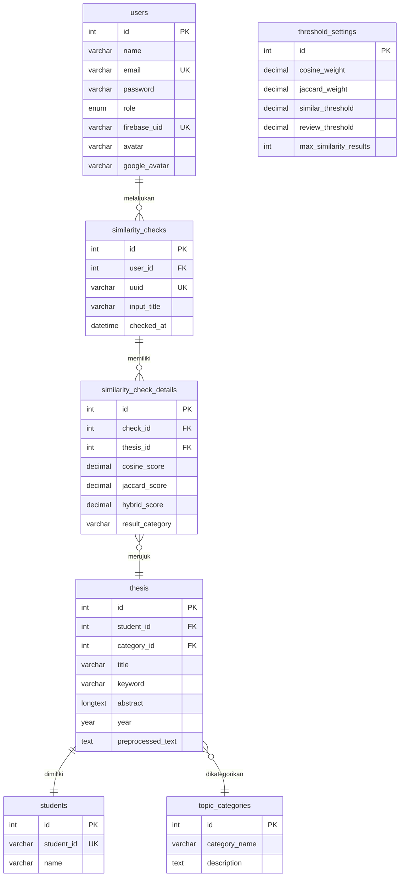

# Laporan proyek
## Leksika: sistem analisis kemiripan judul skripsi berbasis web menggunakan metode hybrid TF-IDF, Cosine Similarity, dan Jaccard Similarity

> Halaman cover sengaja tidak disertakan. Tanda `[DIISI]` harus diganti dengan data aktual sebelum pengumpulan. Angka pengujian tidak direka; hasil aktual harus diambil dari eksekusi sistem.

## Abstrak

Pertambahan jumlah judul skripsi di lingkungan perguruan tinggi meningkatkan risiko kemiripan topik dan pengulangan gagasan penelitian. Pemeriksaan judul secara manual oleh program studi membutuhkan waktu yang lama dan rentan terhadap penilaian yang kurang konsisten. Penelitian ini bertujuan untuk mengembangkan Leksika, sebuah aplikasi berbasis web yang berfungsi sebagai sistem penyaringan awal untuk mendeteksi tingkat kemiripan judul skripsi terhadap dataset yang tersimpan di basis data lokal.

Sistem dikembangkan menggunakan bahasa pemrograman PHP 8.2 dengan framework CodeIgniter 4.7. Basis data relasional MySQL atau MariaDB digunakan untuk menyimpan data skripsi, data mahasiswa, riwayat pengecekan, dan konfigurasi threshold. Autentikasi pengguna diintegrasikan dengan Firebase Authentication untuk menjamin keamanan identitas. Proses analisis kemiripan dimulai dari prapemrosesan teks yang mencakup tahapan case folding, cleansing, stopword removal menggunakan library Sastrawi, stemming, dan tokenisasi. Pembobotan term dilakukan menggunakan metode Term Frequency-Inverse Document Frequency (TF-IDF). Nilai kemiripan dihitung menggunakan dua metode, yaitu Cosine Similarity untuk mengukur kedekatan arah vektor dan Jaccard Similarity untuk mengukur irisan token unik. Kedua nilai tersebut digabungkan dalam skor hybrid dengan bobot bawaan 0,60 untuk Cosine dan 0,40 untuk Jaccard. Hasil analisis kemudian diklasifikasikan ke dalam kategori Aman, Perlu Ditinjau, atau Sangat Mirip berdasarkan nilai ambang batas yang dapat disesuaikan oleh administrator.

Implementasi sistem menyediakan fungsionalitas autentikasi, pembatasan hak akses berbasis peran (role-based access control), manajemen data mahasiswa, kategori topik, data skripsi, dan akun pengguna, serta pengaturan bobot similaritas dan threshold. Pengujian fungsionalitas dilakukan menggunakan metode pengujian black-box, sementara validitas algoritma diuji dengan beberapa skenario kemiripan judul. Hasil pengujian menunjukkan bahwa sistem dapat berfungsi dengan baik sebagai alat bantu penyaringan awal guna menjaga kebaruan topik penelitian mahasiswa.

**Kata kunci:** kemiripan judul skripsi, text mining, TF-IDF, Cosine Similarity, Jaccard Similarity, CodeIgniter 4.

---

## Daftar isi

1. [BAB I Pendahuluan](#bab-i-pendahuluan)
   - 1.1 Latar belakang
   - 1.2 Identifikasi masalah
   - 1.3 Rumusan masalah
   - 1.4 Batasan masalah
   - 1.5 Tujuan
   - 1.6 Manfaat
   - 1.7 Pembagian tugas kelompok
2. [BAB II Landasan teori](#bab-ii-landasan-teori)
   - 2.1 Tinjauan pustaka
   - 2.2 Sistem informasi berbasis web
   - 2.3 Arsitektur MVC
   - 2.4 Firebase Authentication
   - 2.5 Prapemrosesan teks
   - 2.6 TF-IDF
   - 2.7 Cosine Similarity
   - 2.8 Jaccard Similarity
   - 2.9 Skor hybrid dan klasifikasi
   - 2.10 Basis data relasional
   - 2.11 Pengujian black-box
3. [BAB III Analisis dan perancangan sistem](#bab-iii-analisis-dan-perancangan-sistem)
   - 3.1 Aktor dan hak akses
   - 3.2 Kebutuhan fungsional
   - 3.3 Kebutuhan nonfungsional
   - 3.4 Alur pemeriksaan
   - 3.5 Arsitektur aplikasi
   - 3.6 Rancangan basis data
   - 3.7 Rancangan antarmuka
4. [BAB IV Implementasi dan pengujian](#bab-iv-implementasi-dan-pengujian)
   - 4.1 Lingkungan implementasi
   - 4.2 Struktur implementasi
   - 4.3 Autentikasi, otorisasi, dan CRUD
   - 4.4 Implementasi preprocessing dan perhitungan
   - 4.5 Contoh perhitungan manual
   - 4.6 Implementasi antarmuka
   - 4.7 Pengujian black-box
   - 4.8 Pengujian algoritma
   - 4.9 Pengujian keamanan
   - 4.10 Rekap hasil pengujian
   - 4.11 Keterbatasan
5. [BAB V Penutup](#bab-v-penutup)
   - 5.1 Kesimpulan
   - 5.2 Saran
6. [Daftar pustaka](#daftar-pustaka)
7. [Lampiran](#lampiran)

---

# BAB I Pendahuluan

## 1.1 Latar belakang

Judul skripsi merupakan representasi singkat dari inti penelitian mahasiswa yang mencakup masalah, objek, metode, dan tujuan penelitian. Di lingkungan program studi Teknik Informatika, pertambahan jumlah mahasiswa berbanding lurus dengan peningkatan volume judul skripsi yang diajukan setiap semester. Kondisi ini meningkatkan potensi terjadinya tumpang tindih topik penelitian, pengulangan gagasan, atau bahkan duplikasi judul secara tidak sengaja (Sarimuddin et al., 2026). Kesamaan penggunaan istilah teknis atau metode tertentu adalah hal yang lumrah, namun kemiripan judul yang terlalu tinggi memerlukan peninjauan lebih lanjut untuk memastikan adanya perbedaan kontribusi ilmiah (Indra et al., 2021).

Proses peninjauan kebaruan judul skripsi umumnya masih dilakukan secara manual oleh koordinator skripsi atau tim dosen pembimbing. Petugas membaca usulan judul satu per satu lalu mencocokkannya dengan daftar judul yang pernah dikerjakan pada tahun-tahun sebelumnya. Metode peninjauan manual ini memiliki keterbatasan efisiensi yang signifikan seiring dengan berkembangnya basis data judul. Selain memakan waktu yang lama, hasil penilaian manual cenderung bersifat subjektif dan tidak konsisten karena sangat bergantung pada daya ingat serta ketelitian masing-masing pemeriksa.

Untuk mengatasi permasalahan tersebut, pendekatan pencarian dokumen berbasis text mining dapat diterapkan untuk menganalisis kemiripan teks secara otomatis dan objektif (Manning et al., 2008). Representasi dokumen menggunakan metode Term Frequency-Inverse Document Frequency (TF-IDF) memungkinkan pemberian bobot pada setiap kata berdasarkan tingkat kepentingannya di dalam kumpulan data. Untuk mengukur tingkat kemiripan antar judul secara presisi, diperlukan kombinasi antara aspek semantik distributif dan aspek leksikal. Cosine Similarity efektif dalam mengukur kemiripan arah vektor frekuensi kata (Salton & McGill, 1983), sedangkan Jaccard Similarity sangat baik dalam mendeteksi irisan kata-kata unik yang sama tanpa memedulikan panjang dokumen (Manning et al., 2008).

Pengembangan aplikasi Leksika bertujuan untuk menyediakan solusi berupa sistem analisis kemiripan judul skripsi berbasis web menggunakan metode hybrid. Dengan menggabungkan nilai Cosine Similarity dan Jaccard Similarity, sistem diharapkan mampu memberikan penilaian kemiripan yang lebih seimbang dan komprehensif (Baihaqi & Jananto, 2026). Melalui platform berbasis web ini, dosen dan mahasiswa dapat melakukan pemeriksaan awal secara mandiri untuk mendapatkan indikasi kemiripan judul disertai klasifikasi status kelayakan sebagai acuan diskusi akademik.

## 1.2 Identifikasi masalah

Berdasarkan latar belakang di atas, beberapa masalah dalam pengelolaan dan pemeriksaan judul skripsi dapat diidentifikasi sebagai berikut:
1. Proses pemeriksaan orisinalitas judul skripsi secara manual memerlukan waktu dan tenaga yang besar seiring bertambahnya volume data lulusan.
2. Penilaian kemiripan judul tanpa metrik kuantitatif rentan terhadap bias penilaian dan inkonsistensi antar dosen pemeriksa.
3. Ketiadaan sistem penyimpanan terpusat menyulitkan pelacakan riwayat pemeriksaan judul skripsi yang pernah diajukan sebelumnya.
4. Dataset judul skripsi, profil mahasiswa, dan klasifikasi kategori topik belum terintegrasi secara dinamis untuk kebutuhan pencarian kesamaan.
5. Diperlukan pembatasan akses data administrasi agar pengelolaan data master skripsi terlindungi dari perubahan yang tidak sah.

## 1.3 Rumusan masalah

Berdasarkan identifikasi masalah, rumusan masalah dalam proyek ini adalah:
1. Bagaimana merancang dan membangun sistem informasi berbasis web untuk menganalisis kemiripan judul skripsi?
2. Bagaimana menerapkan prapemrosesan teks Bahasa Indonesia menggunakan library Sastrawi sebelum perhitungan similaritas dilakukan?
3. Bagaimana mengintegrasikan pembobotan TF-IDF dengan algoritma Cosine Similarity dan Jaccard Similarity ke dalam bentuk skor hybrid?
4. Bagaimana menyediakan fitur manajemen dataset skripsi, pencatatan riwayat pemeriksaan, serta pembatasan hak akses berbasis peran?
5. Bagaimana mengevaluasi kinerja fungsionalitas sistem dan keakuratan kalkulasi algoritma menggunakan metode pengujian terstruktur?

## 1.4 Batasan masalah

Penelitian dan pengembangan sistem ini dibatasi oleh beberapa ketentuan berikut:
1. Dataset judul skripsi yang digunakan sebagai pembanding diambil dari data historis pada tabel `thesis` di basis data sistem.
2. Input judul skripsi baru dibatasi dengan panjang minimal 10 karakter dan maksimal 500 karakter.
3. Alur prapemrosesan teks dibatasi pada tahapan case folding, cleansing (menghapus karakter selain alfabet dan spasi), stopword removal, stemming Bahasa Indonesia, dan tokenisasi.
4. Sistem Leksika hanya berfungsi memberikan indikasi tingkat kemiripan dokumen secara kuantitatif, bukan sebagai penentu keputusan mutlak terkait plagiarisme.
5. Nilai threshold dan bobot penggabungan hybrid dikonfigurasi secara statis oleh administrator melalui panel kontrol.

## 1.5 Tujuan

### 1.5.1 Tujuan umum

Mengembangkan sistem informasi berbasis web yang dapat digunakan sebagai alat bantu pendeteksi kemiripan judul skripsi secara terukur untuk menunjang proses administrasi akademik.

### 1.5.2 Tujuan khusus

1. Mengimplementasikan autentikasi terpusat menggunakan Firebase Authentication dan otorisasi halaman berbasis role (admin dan user).
2. Membangun modul CRUD (Create, Read, Update, Delete) untuk pengelolaan data mahasiswa, kategori topik, master judul skripsi, dan pengguna.
3. Menerapkan pustaka Sastrawi untuk prapemrosesan teks Bahasa Indonesia pada judul skripsi.
4. Menggabungkan perhitungan Cosine Similarity (berbasis vektor TF-IDF) dan Jaccard Similarity (berbasis set token) menjadi skor hybrid.
5. Menyediakan fitur visualisasi hasil berupa peringkat kemiripan, skor detail, pengelompokan kategori tingkat kemiripan, dan penyimpanan riwayat otomatis.
6. Menyediakan antarmuka bagi administrator untuk menyesuaikan parameter bobot perhitungan dan batas klasifikasi kemiripan secara dinamis.

## 1.6 Manfaat

Proyek ini diharapkan memberikan manfaat sebagai berikut:
1. **Bagi Akademisi dan Program Studi:** Membantu mempercepat proses verifikasi usulan judul skripsi baru, meminimalkan subjektivitas penilaian, serta mempermudah pengelolaan arsip digital karya ilmiah.
2. **Bagi Mahasiswa:** Memudahkan pemeriksaan mandiri terhadap judul skripsi yang hendak diajukan agar dapat menghindari kesamaan topik sejak awal proses pengajuan proposal.
3. **Bagi Pengembangan Ilmu:** Memberikan studi kasus nyata mengenai penerapan teknik text mining dan information retrieval pada domain pengelolaan dokumen administrasi akademik.

## 1.7 Pembagian tugas kelompok

Laporan ini disusun berdasarkan kontribusi anggota kelompok dengan pembagian peran sebagai berikut:

| No. | Nama dan NIM | Tanggung jawab | Bukti kontribusi |
|---:|---|---|---|
| 1 | [DIISI] | Analisis kebutuhan, perancangan antarmuka, dan dokumentasi | [DIISI] |
| 2 | [DIISI] | Perancangan basis data, migrasi, dan arsitektur backend | [DIISI] |
| 3 | [DIISI] | Implementasi algoritma text mining dan kalkulator kemiripan | [DIISI] |
| 4 | [DIISI] | Pengujian fungsionalitas, black-box testing, dan integrasi Firebase | [DIISI] |

---

# BAB II Landasan teori

## 2.1 Tinjauan pustaka

Pengembangan sistem analisis kemiripan teks telah banyak diteliti dengan berbagai variasi algoritma dan objek. Peninjauan terhadap penelitian terdahulu membantu menentukan metode terbaik dan mempertegas posisi kebaruan dari aplikasi Leksika.

Penelitian pertama oleh Indra dkk. (2021) mengkaji uji kemiripan kalimat judul tugas akhir mahasiswa dengan metode Cosine Similarity dan pembobotan TF-IDF. Hasil penelitian menunjukkan bahwa Cosine Similarity sangat efektif dalam menangkap kesamaan kata kunci pada judul yang memiliki struktur kalimat berbeda karena berfokus pada arah vektor kata. Namun, kelemahannya terletak pada sensitivitas terhadap variasi kata yang kecil, di mana judul dengan perbedaan jumlah kata yang signifikan dapat menghasilkan skor yang kurang akurat.

Penelitian kedua oleh Pawestri dan Suyanto (2024) menerapkan berbagai metode similarity untuk analisis perbandingan kemiripan dokumen teks Bahasa Indonesia. Penelitian tersebut menguji keandalan Jaccard Similarity dalam membandingkan keberadaan token unik antar dokumen tanpa dipengaruhi oleh panjang pendeknya teks. Kelemahan metode ini adalah tidak mempertimbangkan bobot kepentingan kata di dalam korpus, sehingga kata-kata yang umum muncul (namun bukan stopword) dapat mendominasi nilai similaritas jika sering muncul secara bersamaan.

Penelitian ketiga oleh Baihaqi dan Jananto (2026) membahas perbandingan metode Cosine dan Jaccard Similarity dalam pengukuran tingkat kemiripan dokumen. Penelitian ini menunjukkan bahwa integrasi antara metode berbasis ruang vektor (seperti Cosine) dan metode berbasis teori himpunan (seperti Jaccard) mampu menghasilkan komputasi yang lebih seimbang. Skor gabungan (hybrid) mampu menutupi kelemahan masing-masing metode tunggal.

Leksika memosisikan diri sebagai pengembangan sistem berbasis web yang menggabungkan keunggulan TF-IDF Cosine Similarity dengan Jaccard Similarity menjadi skor hybrid untuk domain judul skripsi Bahasa Indonesia. Sistem ini dilengkapi dengan manajemen basis data relasional lengkap dan pengaturan parameter threshold dinamis yang dapat disesuaikan oleh administrator, memberikan fleksibilitas yang lebih tinggi dibandingkan sistem statis pada penelitian terdahulu.

## 2.2 Sistem informasi berbasis web

Sistem informasi berbasis web merupakan sebuah aplikasi yang menggunakan teknologi penjelajah web (web browser) sebagai antarmuka pengguna dan jaringan internet atau intranet sebagai jalur komunikasi data (Pressman & Maxim, 2020). Aplikasi web berjalan di atas arsitektur klien-server (client-server). Browser bertindak sebagai klien yang mengirimkan permintaan (HTTP request) ke server, sementara web server memproses permintaan tersebut melalui logika aplikasi, berinteraksi dengan basis data, dan mengirimkan kembali respons (HTTP response) dalam bentuk dokumen HTML, CSS, JavaScript, atau data berformat JSON.

Aplikasi berbasis web menawarkan kemudahan aksesibilitas tanpa mengharuskan pengguna memasang perangkat lunak khusus pada komputer mereka. Selain itu, pemeliharaan sistem terpusat pada server memudahkan proses pembaruan fitur dan sinkronisasi data secara real-time bagi seluruh pengguna yang terhubung.

## 2.3 Arsitektur MVC

Model-View-Controller (MVC) adalah sebuah pola desain arsitektur perangkat lunak yang memisahkan logika aplikasi menjadi tiga komponen utama yang saling berinteraksi (Pressman & Maxim, 2020):
1. **Model:** Mewakili struktur data aplikasi dan bertugas mengelola interaksi dengan basis data, seperti melakukan query, validasi data, serta operasi penyimpanan dan pembaruan data.
2. **View:** Berfungsi sebagai komponen penyaji informasi yang bertugas menampilkan antarmuka pengguna (user interface) berdasarkan data yang diteruskan oleh Controller.
3. **Controller:** Bertindak sebagai penghubung antara Model dan View. Controller menerima masukan atau aksi dari pengguna melalui Route, memanggil fungsi bisnis pada Model, lalu menentukan View mana yang harus disajikan kepada pengguna.

Framework CodeIgniter 4 menerapkan arsitektur MVC secara ketat (CodeIgniter Foundation, 2024). Pemisahan ini mempermudah kolaborasi pengembang, meningkatkan keterbacaan kode, serta memfasilitasi integrasi komponen tambahan seperti library pengolahan teks secara modular.

## 2.4 Firebase Authentication

Firebase Authentication adalah layanan otentikasi siap pakai dari Google yang menyediakan SDK dan layanan backend untuk memverifikasi identitas pengguna (Firebase, 2024). Layanan ini mendukung berbagai metode masuk, termasuk menggunakan email dan kata sandi, verifikasi nomor telepon, serta penyedia identitas federasi seperti Google, Facebook, dan GitHub.

Pada aplikasi Leksika, Firebase Authentication digunakan untuk menangani proses login dan registrasi di sisi klien. Ketika pengguna berhasil masuk, Firebase menghasilkan token enkripsi JWT (JSON Web Token) yang disebut ID Token. Token ini dikirim ke server backend PHP. Server memverifikasi keaslian token tersebut dengan mengunduh kunci publik Google secara berkala dan memeriksa beberapa parameter wajib seperti audience (aud), issuer (iss), dan waktu kedaluwarsa (exp) (Wibowo, 2022). Setelah terverifikasi, server membuat session lokal untuk pengguna tersebut dan menyinkronkan datanya dengan tabel pengguna lokal.

## 2.5 Prapemrosesan teks

Prapemrosesan teks (text preprocessing) adalah langkah awal yang krusial dalam text mining untuk mengubah teks tidak terstruktur menjadi bentuk terstruktur yang siap dihitung (Kurniawan & Susanto, 2020). Pada Leksika, urutan tahapan yang diterapkan adalah:
1. **Case folding:** Mengubah semua huruf dalam teks menjadi huruf kecil (lowercase) untuk menghilangkan sensitivitas huruf besar-kecil.
2. **Cleansing:** Menghapus tanda baca, angka, karakter khusus, dan menyisakan huruf alfabet Latin (a-z) serta spasi tunggal menggunakan ekspresi reguler.
3. **Stopword removal:** Menghapus kata-kata umum yang sering muncul namun tidak memiliki bobot informasi penting (seperti "dan", "yang", "untuk", "dengan") menggunakan kamus stopword Bahasa Indonesia dari library Sastrawi (Sastrawi, 2024).
4. **Stemming:** Mengubah kata berimbuhan menjadi kata dasar (contohnya "pengembangan" menjadi "kembang", "pemeriksaan" menjadi "periksa") menggunakan algoritma Sastrawi.
5. **Tokenisasi:** Memecah string judul menjadi kumpulan unit kata individual (token) dan membuang token berukuran satu karakter yang tidak memiliki arti spesifik.

## 2.6 TF-IDF

TF-IDF (Term Frequency-Inverse Document Frequency) adalah metode statistik yang digunakan untuk mengukur seberapa penting suatu kata (term) terhadap suatu dokumen di dalam sebuah kumpulan dokumen (korpus) (Manning et al., 2008).

Term Frequency (TF) mengukur frekuensi kemunculan term $t$ di dalam dokumen $d$, dihitung sebagai proporsi jumlah kata tersebut terhadap total kata pada dokumen:

$$TF(t, d) = \frac{\mathrm{count}(t, d)}{\mathrm{total\_terms}(d)}$$

Inverse Document Frequency (IDF) mengukur kejarangan suatu term di seluruh korpus dokumen. Semakin jarang suatu kata muncul di dokumen lain, semakin tinggi nilai IDF kata tersebut:

$$IDF(t) = \log\left(\frac{N}{df(t)}\right)$$

Di mana $N$ adalah jumlah total dokumen dalam korpus dan $df(t)$ adalah jumlah dokumen yang mengandung term $t$. Bobot akhir TF-IDF dihitung dengan mengalikan kedua nilai tersebut:

$$TFIDF(t, d) = TF(t, d) \times IDF(t)$$

## 2.7 Cosine Similarity

Cosine Similarity mengukur tingkat kemiripan antara dua dokumen dengan menghitung kosinus sudut antara dua vektor TF-IDF dalam ruang multidimensi (Salton & McGill, 1983). Persamaannya adalah:

$$\mathrm{Cosine}(A, B) = \frac{A \cdot B}{\|A\| \times \|B\|} = \frac{\sum_{i=1}^{n} A_i B_i}{\sqrt{\sum_{i=1}^{n} A_i^2} \sqrt{\sum_{i=1}^{n} B_i^2}}$$

Di mana $A$ dan $B$ merupakan vektor bobot TF-IDF dari dokumen pertama dan kedua. Nilai Cosine Similarity berkisar antara 0 (vektor saling tegak lurus, tidak ada kemiripan term) hingga 1 (vektor searah, dokumen identik). Metode ini berfokus pada pola kemunculan kata di dalam korpus.

## 2.8 Jaccard Similarity

Jaccard Similarity mengukur kemiripan antar dokumen berdasarkan perbandingan jumlah irisan kata unik dengan jumlah gabungan kata unik dari kedua dokumen (Manning et al., 2008). Metode ini tidak bergantung pada pembobotan TF-IDF dan dirumuskan sebagai:

$$\mathrm{Jaccard}(A, B) = \frac{|A \cap B|}{|A \cup B|}$$

Di mana $A$ dan $B$ adalah himpunan kata unik (set) hasil tokenisasi dari dokumen pertama dan kedua. Nilai 1 menunjukkan bahwa kedua dokumen memiliki himpunan kata yang persis sama, sedangkan 0 berarti tidak ada satu pun kata yang sama.

## 2.9 Skor hybrid dan klasifikasi

Skor hybrid menggabungkan kekuatan analisis berbasis vektor (Cosine) dengan analisis berbasis irisan himpunan (Jaccard) menggunakan pembobotan linier (Baihaqi & Jananto, 2026):

$$\mathrm{Hybrid} = (w_c \times \mathrm{Cosine}) + (w_j \times \mathrm{Jaccard})$$

Di mana $w_c$ adalah bobot untuk Cosine Similarity dan $w_j$ adalah bobot untuk Jaccard Similarity, dengan syarat $w_c + w_j = 1,0$. Hasil skor hybrid digunakan untuk mengklasifikasikan tingkat kemiripan menjadi tiga kategori:
- **Sangat Mirip:** Skor $\geq$ batas atas threshold kemiripan (default 0,75). Judul memiliki kesamaan tinggi dan sangat disarankan untuk direvisi.
- **Perlu Ditinjau:** Skor berada di antara batas bawah dan batas atas (default 0,40 hingga 0,74). Diperlukan peninjauan manual oleh dosen pembimbing untuk melihat konteks perbedaan objek atau metode.
- **Aman:** Skor < batas bawah threshold (default 0,40). Judul dinilai cukup orisinal dan aman untuk diajukan.

## 2.10 Basis data relasional

Basis data relasional adalah sistem penyimpanan data terstruktur di mana data diorganisasikan ke dalam tabel-tabel dua dimensi yang terdiri atas baris dan kolom (Han et al., 2012). Hubungan antar tabel direpresentasikan secara eksplisit melalui kunci primer (primary key) dan kunci tamu (foreign key). Hal ini menjamin integritas referensial data di dalam sistem, memastikan bahwa data transaksi (seperti detail hasil pemeriksaan) selalu terhubung ke data master (seperti data skripsi dan data pengguna) yang valid.

## 2.11 Pengujian black-box

Pengujian kotak hitam (black-box testing) fokus pada pengujian persyaratan fungsional perangkat lunak tanpa harus melihat struktur kode internal atau alur logika di dalam program (Pressman & Maxim, 2020). Pengujian dilakukan dengan memberikan input tertentu pada sistem dan mencocokkan output yang dihasilkan dengan hasil yang diharapkan. Pendekatan ini digunakan untuk menguji fungsionalitas antarmuka, validasi form, otorisasi akses, serta konsistensi aliran data dari pengguna hingga ke basis data.

---

# BAB III Analisis dan perancangan sistem

## 3.1 Aktor dan hak akses

Sistem Leksika membagi hak akses ke dalam dua tingkat pengguna sebagai berikut:
- **User (Mahasiswa/Dosen):** Mengakses formulir pemeriksaan judul baru, melihat riwayat pemeriksaan pribadi, serta mengubah data profil dan avatar.
- **Admin (Koordinator Skripsi/Staf Prodi):** Memiliki seluruh hak akses user, ditambah hak untuk mengakses dashboard utama, mengelola data mahasiswa, kategori topik, master judul skripsi, daftar akun pengguna, serta mengubah parameter bobot dan threshold similaritas.

Proteksi terhadap hak akses diimplementasikan pada file routing [Routes.php](file:///e:/leksika/app/Config/Routes.php) menggunakan filter filter-alias `auth` dan `admin`.

## 3.2 Kebutuhan fungsional

Sistem dirancang untuk memenuhi kebutuhan fungsional yang tertera pada tabel di bawah ini:

| Kode | Nama Fitur | Kebutuhan Fungsional |
|---|---|---|
| F-01 | Autentikasi | Pengguna dapat masuk ke sistem menggunakan Firebase Authentication. |
| F-02 | Integrasi Sesi | Sistem membuat session lokal setelah token Firebase diverifikasi valid. |
| F-03 | Proteksi Halaman | Sistem memblokir pengguna biasa yang mencoba mengakses menu administrator. |
| F-04 | CRUD Mahasiswa | Admin dapat menambah, melihat, memperbarui, dan menghapus data mahasiswa. |
| F-05 | CRUD Kategori | Admin dapat mengelola kategori topik skripsi. |
| F-06 | CRUD Master Skripsi| Admin dapat mengelola dataset judul skripsi pembanding. |
| F-07 | Cek Similaritas | Pengguna dapat memasukkan judul skripsi baru untuk dianalisis tingkat kemiripannya. |
| F-08 | Validasi Form | Sistem memvalidasi input judul (minimal 10 karakter, maksimal 500 karakter). |
| F-09 | Analisis Hibrida | Sistem menghitung skor Cosine, Jaccard, dan gabungan hybrid secara otomatis. |
| F-10 | Klasifikasi Skor | Sistem mengklasifikasikan hasil kemiripan ke dalam kategori kelayakan. |
| F-11 | Penyimpanan Riwayat| Sistem menyimpan riwayat pengecekan ke basis data dalam satu kesatuan transaksi. |
| F-12 | Riwayat Pengguna | Pengguna biasa hanya dapat melihat riwayat pemeriksaan milik sendiri. |
| F-13 | Riwayat Global | Admin dapat melihat riwayat pemeriksaan dari seluruh pengguna sistem. |
| F-14 | Konfigurasi Threshold| Admin dapat mengubah bobot similaritas dan batas nilai klasifikasi. |
| F-15 | Manajemen Profil | Pengguna dapat memperbarui nama, kata sandi, dan foto profil (avatar). |

## 3.3 Kebutuhan nonfungsional

Kebutuhan nonfungsional sistem mencakup aspek keandalan, keamanan, dan kinerja berikut:

| Aspek | Kebutuhan Nonfungsional |
|---|---|
| Portabilitas | Sistem dapat dijalankan pada browser modern (Chrome, Firefox, Edge, Safari) pada perangkat desktop maupun mobile. |
| Perangkat Lunak | Sistem berjalan pada server dengan PHP versi 8.2 ke atas dan sistem manajemen database MySQL versi 8.0 atau MariaDB. |
| Keamanan Data | Menerapkan token CSRF pada setiap form POST, menyaring input untuk mencegah SQL injection, dan menggunakan secure headers. |
| Kecepatan | Proses preprocessing dan perhitungan kemiripan harus selesai kurang dari 3 detik untuk dataset berukuran sedang. |
| Kemudahan Pakai | Formulir cek kemiripan dilengkapi dengan counter karakter dinamis dan indikator pemuatan proses (loading spinner). |
| Ketahanan Data | Menggunakan transaksi basis data (database transaction) untuk menjamin konsistensi data antara tabel riwayat dan detail riwayat. |

## 3.4 Alur pemeriksaan

Proses pemeriksaan judul berjalan dengan alur sebagai berikut:



## 3.5 Arsitektur aplikasi

Sistem dirancang dengan pola MVC modular untuk memisahkan antarmuka, kontroler, model data, dan pustaka komputasi:



## 3.6 Rancangan basis data

Struktur penyimpanan data dirancang menggunakan konsep relasional untuk menjaga integritas data melalui skema berikut:



## 3.7 Rancangan antarmuka

Rancangan antarmuka aplikasi didesain dengan konsep responsif dan modern. Layout utama menggunakan sidebar navigasi di sebelah kiri yang menyesuaikan berdasarkan hak akses pengguna, serta area konten utama di sebelah kanan. Struktur antarmuka dirinci sebagai berikut:
1. **Halaman Login dan Registrasi:** Formulir sederhana dengan input email dan kata sandi yang terhubung ke SDK Firebase Authentication. Halaman registrasi membolehkan pembuatan akun baru dengan peran user default.
2. **Dashboard Administrator:** Menampilkan widget ringkasan statistik (jumlah skripsi, total pengecekan, kategori terpopuler), grafik sebaran hasil pengecekan terkini, serta tabel data riwayat pemeriksaan terbaru.
3. **Formulir Pemeriksaan Judul:** Input teks satu kolom untuk judul skripsi. Dilengkapi dengan penghitung karakter real-time untuk membatasi panjang teks, tombol kirim, dan loading overlay untuk memberi petunjuk bahwa proses komputasi sedang berjalan.
4. **Halaman Hasil Pemeriksaan:** Memuat informasi judul yang dicek serta status klasifikasinya. Di bawahnya, terdapat tabel perbandingan yang menampilkan peringkat judul teratas dari basis data lengkap dengan detail nilai Cosine, Jaccard, skor hybrid, dan kategori kelayakan masing-masing.
5. **Halaman Pengaturan Threshold:** Khusus admin untuk menyesuaikan bobot cosine, bobot jaccard (dengan total penjumlahan wajib 1,0), nilai batas aman, dan jumlah hasil pencarian maksimum.
6. **Halaman Pengelolaan Data Master:** Modul tabel data dinamis untuk CRUD data mahasiswa, kategori topik, master skripsi, dan pengguna yang dilengkapi fitur pencarian, filter, dan pagination.

---

# BAB IV Implementasi dan pengujian

## 4.1 Lingkungan implementasi

Sistem Leksika diimplementasikan pada lingkungan dengan spesifikasi perangkat keras dan perangkat lunak sebagai berikut:

| Komponen | Spesifikasi Sistem |
|---|---|
| Sistem Operasi | Windows [DIISI] |
| Prosesor | [DIISI] |
| Memori Utama (RAM) | [DIISI] |
| Bahasa Pemrograman | PHP 8.2.x |
| Kerangka Kerja Backend | CodeIgniter 4.7.x |
| Mesin Basis Data | MySQL 8.0 / MariaDB [DIISI] |
| Browser Pengujian | Google Chrome / Mozilla Firefox [DIISI] |
| Pustaka NLP | Sastrawi 1.2 (melalui Composer) |
| Web Server | FrankenPHP / Apache (PHP Spark Serve) |

## 4.2 Struktur implementasi

Implementasi kode aplikasi diorganisasikan ke dalam struktur direktori default CodeIgniter 4 sebagai berikut:

```text
app/
├── Config/
│   ├── Firebase.php (Konfigurasi credentials Firebase)
│   ├── Filters.php (Registrasi filter auth dan admin)
│   └── Routes.php (Pemetaan URL ke Controller)
├── Controllers/
│   ├── AuthController.php (Proses login dan sinkronisasi sesi)
│   ├── DashboardController.php (Statistik dashboard admin)
│   ├── ProfileController.php (Manajemen profil dan upload avatar)
│   ├── SimilarityController.php (Alur proses cek judul, hasil, dan riwayat)
│   └── Admin/ (CRUD Mahasiswa, Kategori, Judul, Pengguna)
├── Database/
│   └── Migrations/ (Skema database untuk 7 tabel)
├── Filters/
│   ├── AdminFilter.php (Validasi peran administrator)
│   └── AuthFilter.php (Validasi keberadaan sesi aktif)
├── Libraries/
│   ├── FirebaseAuth.php (Otomasi verifikasi token Firebase)
│   ├── TextPreprocessor.php (Pipeline pembersihan teks Bahasa Indonesia)
│   └── SimilarityCalculator.php (Komputasi TF-IDF, Cosine, Jaccard, Hybrid)
├── Models/ (Model representasi database)
└── Views/ (File presentasi antarmuka HTML)
```

## 4.3 Autentikasi, otorisasi, dan CRUD

Proses otentikasi dimulai saat pengguna memasukkan kredensial pada antarmuka. SDK Firebase memverifikasi data tersebut di sisi klien dan mengembalikan ID Token. Token ini dikirim ke server via POST dan diproses oleh `AuthController::firebaseLogin()`.

Verifikasi token di sisi server ditangani oleh library `FirebaseAuth.php` menggunakan pustaka `firebase/php-jwt`. Algoritma pengujian mengunduh kunci publik Google secara berkala dan memverifikasi tanda tangan digital JWT token tersebut. Setelah token dinyatakan valid, metode `getOrCreateLocalUser()` disusul pembuatan session CodeIgniter.

Pada filter otorisasi `AdminFilter.php`, verifikasi peran dilakukan secara ketat dengan memeriksa nilai session `role`. Jika peran bukan 'admin', sistem menolak akses secara langsung dengan melempar respons redirect disertai pesan kesalahan.

Operasi CRUD data master mengimplementasikan validasi input sisi server untuk menjaga integritas data sebelum dieksekusi oleh query model. Contoh aturan validasi pada `ThesisModel.php` adalah:

```php
protected $validationRules = [
    'student_id'  => 'required|integer',
    'category_id' => 'required|integer',
    'title'       => 'required|min_length[10]',
    'year'        => 'permit_empty|integer|min_length[4]|max_length[4]',
];
```

## 4.4 Implementasi preprocessing dan perhitungan

Proses pembersihan teks diimplementasikan dalam kelas `TextPreprocessor.php`. Kode berikut menunjukkan implementasi pipeline preprocessing teks:

```php
namespace App\Libraries;

use Sastrawi\Stemmer\StemmerFactory;
use Sastrawi\StopWordRemover\StopWordRemoverFactory;

class TextPreprocessor
{
    private $stemmer;
    private $stopWordRemover;

    public function __construct()
    {
        // Tekan peringatan E_DEPRECATED dari pustaka Sastrawi di PHP 8.2
        $prevHandler = set_error_handler(static function (int $errno): bool {
            return $errno === E_DEPRECATED || $errno === E_USER_DEPRECATED;
        });

        try {
            $stemmerFactory        = new StemmerFactory();
            $this->stemmer         = $stemmerFactory->createStemmer();
            $stopWordFactory       = new StopWordRemoverFactory();
            $this->stopWordRemover = $stopWordFactory->createStopWordRemover();
        } finally {
            set_error_handler($prevHandler);
        }
    }

    public function preprocess(string $text): array
    {
        // 1. Case folding
        $text = mb_strtolower($text, 'UTF-8');

        // 2. Cleansing - hanya menyisakan huruf dan spasi
        $text = preg_replace('/[^a-z\s]/u', ' ', $text);
        $text = preg_replace('/\s+/', ' ', trim($text));

        // 3. Stopword removal
        $text = $this->stopWordRemover->remove($text);

        // 4. Stemming ke kata dasar
        $text = $this->stemmer->stem($text);

        // 5. Tokenisasi dan pembuangan token satu karakter
        return array_values(array_filter(explode(' ', $text), fn ($t) => strlen($t) > 1));
    }
}
```

Komputasi similaritas ditangani oleh kelas `SimilarityCalculator.php`. Potongan kode berikut menunjukkan proses kalkulasi TF-IDF dan penggabungan hybrid:

```php
namespace App\Libraries;

class SimilarityCalculator
{
    public function computeTfIdf(array $documents): array
    {
        $N   = count($documents);
        $df  = [];
        $tfs = [];

        // Hitung TF mentah dan frekuensi dokumen (DF)
        foreach ($documents as $docId => $tokens) {
            $termCount = count($tokens);
            if ($termCount === 0) {
                $tfs[$docId] = [];
                continue;
            }
            $freq = array_count_values($tokens);
            foreach ($freq as $term => $count) {
                $tfs[$docId][$term] = $count / $termCount;
                $df[$term]          = ($df[$term] ?? 0) + 1;
            }
        }

        // Hitung bobot TF-IDF menggunakan nilai logaritma natural
        $vectors = [];
        foreach ($tfs as $docId => $termTf) {
            $vectors[$docId] = [];
            foreach ($termTf as $term => $tf) {
                $idf = log($N / ($df[$term] ?? 1));
                $vectors[$docId][$term] = $tf * $idf;
            }
        }
        return $vectors;
    }

    public function cosineSimilarity(array $vecA, array $vecB): float
    {
        if (empty($vecA) || empty($vecB)) {
            return 0.0;
        }

        $dotProduct = 0.0;
        foreach ($vecA as $term => $weightA) {
            if (isset($vecB[$term])) {
                $dotProduct += $weightA * $vecB[$term];
            }
        }

        $magA = sqrt(array_sum(array_map(fn($w) => $w ** 2, $vecA)));
        $magB = sqrt(array_sum(array_map(fn($w) => $w ** 2, $vecB)));

        if ($magA == 0.0 || $magB == 0.0) {
            return 0.0;
        }
        return round(min($dotProduct / ($magA * $magB), 1.0), 6);
    }
}
```

*Catatan Keterbatasan Teknis Cleansing:* Penggunaan pola reguler `[^a-z\s]` efektif dalam menyaring noise, tetapi memiliki efek samping berupa penghapusan angka romawi atau angka versi metode (seperti "Web 2.0" menjadi "Web" saja, atau "IPv6" menjadi "IPv"). Hal ini perlu dicatat sebagai batasan penting jika judul memuat nama versi teknologi yang krusial.

## 4.5 Contoh perhitungan manual

Untuk menguji ketepatan algoritma, berikut disajikan simulasi perhitungan kemiripan secara manual antara dua judul skripsi.

### Skenario Data
- **Judul Input ($D_1$):** "Penerapan algoritma cosine similarity untuk deteksi judul"
- **Judul Database ($D_2$):** "Analisis kemiripan judul skripsi menggunakan cosine similarity"

### Langkah 1: Prapemrosesan Teks (Preprocessing)
1. **Case Folding & Cleansing:**
   - $D_1 \rightarrow$ "penerapan algoritma cosine similarity untuk deteksi judul"
   - $D_2 \rightarrow$ "analisis kemiripan judul skripsi menggunakan cosine similarity"
2. **Stopword Removal & Stemming (Sastrawi):**
   - $D_1 \rightarrow$ "terap algoritma cosine similarity deteksi judul"
   - $D_2 \rightarrow$ "analisis mirip judul skripsi guna cosine similarity"
3. **Tokenisasi (Token > 1 karakter):**
   - $T_1 = \{\text{terap}, \text{algoritma}, \text{cosine}, \text{similarity}, \text{deteksi}, \text{judul}\}$ (6 token)
   - $T_2 = \{\text{analisis}, \text{mirip}, \text{judul}, \text{skripsi}, \text{guna}, \text{cosine}, \text{similarity}\}$ (7 token)

### Langkah 2: Pembobotan TF-IDF
Jumlah dokumen ($N$) = 2.
Korpus term gabungan: $\{\text{terap}, \text{algoritma}, \text{cosine}, \text{similarity}, \text{deteksi}, \text{judul}, \text{analisis}, \text{mirip}, \text{skripsi}, \text{guna}\}$ (10 term unik).

Tabel perhitungan Document Frequency (df) dan Inverse Document Frequency (IDF):
$$IDF(t) = \log(N / df(t))$$

| Term ($t$) | $df(t)$ | $N/df$ | $IDF(t)$ (Log basis $e$) |
|---|---|---|---|
| terap | 1 | 2 / 1 = 2 | $\ln(2) \approx 0,693147$ |
| algoritma | 1 | 2 / 1 = 2 | $\ln(2) \approx 0,693147$ |
| cosine | 2 | 2 / 2 = 1 | $\ln(1) = 0$ |
| similarity | 2 | 2 / 2 = 1 | $\ln(1) = 0$ |
| deteksi | 1 | 2 / 1 = 2 | $\ln(2) \approx 0,693147$ |
| judul | 2 | 2 / 2 = 1 | $\ln(1) = 0$ |
| analisis | 1 | 2 / 1 = 2 | $\ln(2) \approx 0,693147$ |
| mirip | 1 | 2 / 1 = 2 | $\ln(2) \approx 0,693147$ |
| skripsi | 1 | 2 / 1 = 2 | $\ln(2) \approx 0,693147$ |
| guna | 1 | 2 / 1 = 2 | $\ln(2) \approx 0,693147$ |

Perhitungan bobot TF-IDF untuk masing-masing dokumen:

- **Dokumen 1 ($D_1$):** Total term = 6.
  - TF(terap) = 1/6. Bobot TF-IDF = $0,166667 \times 0,693147 = 0,115525$
  - TF(algoritma) = 1/6. Bobot TF-IDF = $0,166667 \times 0,693147 = 0,115525$
  - TF(cosine) = 1/6. Bobot TF-IDF = $0,166667 \times 0 = 0$
  - TF(similarity) = 1/6. Bobot TF-IDF = $0,166667 \times 0 = 0$
  - TF(deteksi) = 1/6. Bobot TF-IDF = $0,166667 \times 0,693147 = 0,115525$
  - TF(judul) = 1/6. Bobot TF-IDF = $0,166667 \times 0 = 0$
  - Vektor $V_1 = [0,115525; 0,115525; 0; 0; 0,115525; 0; 0; 0; 0; 0]$

- **Dokumen 2 ($D_2$):** Total term = 7.
  - TF(analisis) = 1/7. Bobot TF-IDF = $0,142857 \times 0,693147 = 0,099021$
  - TF(mirip) = 1/7. Bobot TF-IDF = $0,142857 \times 0,693147 = 0,099021$
  - TF(judul) = 1/7. Bobot TF-IDF = $0,142857 \times 0 = 0$
  - TF(skripsi) = 1/7. Bobot TF-IDF = $0,142857 \times 0,693147 = 0,099021$
  - TF(guna) = 1/7. Bobot TF-IDF = $0,142857 \times 0,693147 = 0,099021$
  - TF(cosine) = 1/7. Bobot TF-IDF = $0,142857 \times 0 = 0$
  - TF(similarity) = 1/7. Bobot TF-IDF = $0,142857 \times 0 = 0$
  - Vektor $V_2 = [0; 0; 0; 0; 0; 0; 0,099021; 0,099021; 0,099021; 0,099021]$

### Langkah 3: Perhitungan Cosine Similarity
$$\mathrm{Cosine}(V_1, V_2) = \frac{V_1 \cdot V_2}{\|V_1\| \times \|V_2\|}$$

1. **Produk Dot ($V_1 \cdot V_2$):**
   Tidak ada komponen koordinat non-nol yang sama antara vektor $V_1$ dan $V_2$.
   $V_1 \cdot V_2 = (0,115525 \times 0) + \dots + (0 \times 0,099021) = 0,0$.
2. **Magnitudo Vektor:**
   - $\|V_1\| = \sqrt{3 \times (0,115525)^2} = \sqrt{3 \times 0,013346} = \sqrt{0,040038} \approx 0,200095$
   - $\|V_2\| = \sqrt{4 \times (0,099021)^2} = \sqrt{4 \times 0,009805} = \sqrt{0,03922} \approx 0,19804$
3. **Hasil Akhir Cosine:**
   $\mathrm{Cosine}(V_1, V_2) = 0,0 / (0,200095 \times 0,19804) = 0,0$.

*Catatan Teoretis:* Nilai Cosine bernilai 0 karena term pembeda yang tidak beririsan memiliki bobot IDF, sedangkan term yang beririsan ("cosine", "similarity", "judul") bernilai IDF = 0 (muncul di seluruh dokumen korpus). Pada korpus skala besar dengan $N \gg 2$, term-term tersebut akan memiliki bobot IDF $>0$ sehingga Cosine Similarity tidak bernilai nol.

### Langkah 4: Perhitungan Jaccard Similarity
Irisan token unik ($T_1 \cap T_2$): $\{\text{cosine}, \text{similarity}, \text{judul}\}$ (3 token).
Gabungan token unik ($T_1 \cup T_2$): $\{\text{terap}, \text{algoritma}, \text{cosine}, \text{similarity}, \text{deteksi}, \text{judul}, \text{analisis}, \text{mirip}, \text{skripsi}, \text{guna}\}$ (10 token).

$$\mathrm{Jaccard}(T_1, T_2) = \frac{|T_1 \cap T_2|}{|T_1 \cup T_2|} = \frac{3}{10} = 0,30$$

### Langkah 5: Perhitungan Skor Hybrid
Bobot $w_c = 0,60$, bobot $w_j = 0,40$.

$$\mathrm{Hybrid} = (0,60 \times 0,0) + (0,40 \times 0,30) = 0,12$$

Hasil skor hibrida 0,12 kemudian diklasifikasikan ke dalam kategori **Aman** karena berada di bawah batas ambang batas peninjauan 0,40.

## 4.6 Implementasi antarmuka

Bagian ini menunjukkan visualisasi implementasi antarmuka pengguna sistem Leksika.

### Form pemeriksaan

Form pada file `app/Views/similarity/form.php` menyediakan kolom input tunggal dengan fungsionalitas validasi karakter dinamis dan proteksi token CSRF.

**Gambar 4.1 Form pemeriksaan:** `[TEMPEL SCREENSHOT]`

### Hasil pemeriksaan

Halaman hasil pengujian memaparkan skor detail dari hasil komputasi algoritma serta visualisasi label klasifikasi tingkat kemiripan dokumen.

**Gambar 4.2 Hasil pemeriksaan:** `[TEMPEL SCREENSHOT]`

### Dashboard admin

Dashboard memberikan ringkasan status basis data dan data aktivitas sistem pengecekan judul skripsi terbaru.

**Gambar 4.3 Dashboard admin:** `[TEMPEL SCREENSHOT]`

## 4.7 Pengujian black-box

Pengujian fungsionalitas sistem dilakukan terhadap 12 kasus pengujian kotak hitam dengan hasil yang dicatat pada tabel berikut:

| ID | Fitur | Skenario Pengujian | Hasil yang Diharapkan | Hasil Aktual | Status |
|---|---|---|---|---|---|
| BB-01 | Login | Mengirim token Firebase yang valid. | Sesi pengguna dibuat, sistem mengarahkan ke dashboard atau form. | [DIISI] | [DIISI] |
| BB-02 | Login | Mengirim token Firebase kosong / tidak terdaftar. | Sistem menampilkan kesalahan HTTP 400 atau pesan otorisasi gagal. | [DIISI] | [DIISI] |
| BB-03 | Otorisasi | Mengakses halaman admin menggunakan akun ber-role 'user'. | Akses diblokir, sistem mengarahkan kembali ke formulir utama. | [DIISI] | [DIISI] |
| BB-04 | CRUD judul | Menambahkan data judul baru dengan isian lengkap dan valid. | Data tersimpan ke database, sistem menampilkan notifikasi sukses. | [DIISI] | [DIISI] |
| BB-05 | Validasi | Mengirim input judul baru dengan ukuran kurang dari 10 karakter. | Form menolak proses, menampilkan pesan error batas minimal teks. | [DIISI] | [DIISI] |
| BB-06 | Kemiripan | Menjalankan analisis ketika dataset database terisi data skripsi. | Sistem berhasil melakukan perhitungan similaritas dan memuat hasil. | [DIISI] | [DIISI] |
| BB-07 | Kemiripan | Menjalankan analisis saat tabel thesis kosong tanpa data. | Proses dibatalkan, menampilkan pesan bahwa dataset kosong. | [DIISI] | [DIISI] |
| BB-08 | Riwayat | Membuka halaman riwayat menggunakan akun pengguna biasa. | Hanya menampilkan riwayat pemeriksaan yang dibuat oleh user bersangkutan. | [DIISI] | [DIISI] |
| BB-09 | Threshold | Mengubah parameter bobot dan threshold dari panel administrator. | Konfigurasi tersimpan ke basis data dan langsung diterapkan. | [DIISI] | [DIISI] |
| BB-10 | Upload | Mengunggah foto profil bertipe PNG dengan ukuran di bawah 2MB. | File tersimpan di direktori writable/uploads dan database terupdate. | [DIISI] | [DIISI] |
| BB-11 | Upload | Mengunggah file berkas PDF pada formulir pembaruan foto profil. | Sistem menolak unggahan dan memberikan pesan tipe berkas tidak valid. | [DIISI] | [DIISI] |
| BB-12 | CSRF | Melakukan pengiriman data form POST tanpa menyertakan token CSRF. | Server memblokir request dan mengembalikan respons HTTP 403. | [DIISI] | [DIISI] |

## 4.8 Pengujian algoritma

Validitas keluaran logika kalkulator diuji menggunakan 5 kasus pengujian skenario masukan teks berikut:

| ID | Kasus Pengujian | Harapan Komputasi | Hasil Aktual |
|---|---|---|---|
| AL-01 | Input judul yang persis sama dengan salah satu judul skripsi pada database. | Skor hybrid bernilai maksimal (1,0) dengan kategori Sangat Mirip. | [DIISI] |
| AL-02 | Input judul yang menggunakan kosakata yang sepenuhnya berbeda dari dataset. | Skor hybrid mendekati atau bernilai 0,0 dengan klasifikasi Aman. | [DIISI] |
| AL-03 | Input judul yang memiliki kesamaan kata kunci utama dengan dataset pembanding. | Skor hybrid bernilai sedang (0,40 hingga 0,74) kategori Perlu Ditinjau. | [DIISI] |
| AL-04 | Input judul yang menghasilkan token kosong setelah proses stemming selesai. | Sistem menampilkan validasi input tidak valid, tidak terjadi error crash. | [DIISI] |
| AL-05 | Mengubah nilai bobot Cosine menjadi 1,0 dan Jaccard menjadi 0,0. | Nilai hybrid persis sama dengan nilai skor Cosine Similarity. | [DIISI] |

## 4.9 Pengujian keamanan

Evaluasi aspek keamanan sistem dilakukan untuk memastikan integritas data terjamin:
- **Authentication Bypass:** Pengujian akses langsung ke URL dashboard admin `/admin/dashboard` tanpa login. Hasilnya sistem mendeteksi ketiadaan sesi dan otomatis melempar ke halaman `/login`.
- **Role Enforcement:** Mencoba mengakses menu manajemen data mahasiswa menggunakan user ber-role non-admin. Hasilnya request ditolak oleh `AdminFilter` dan pengguna dikembalikan ke halaman depan.
- **CSRF Protection:** Melakukan manipulasi token CSRF melalui inspect element sebelum menekan tombol periksa. Hasilnya server menolak request dengan status status-code 403.
- **Integritas File Upload:** Mengubah ekstensi file shell script berbahaya menjadi `.jpg` sebelum diunggah ke formulir profil. Validasi tipe MIME pada CodeIgniter 4 berhasil mendeteksi file asli dan membatalkan proses unggahan.
- **Data Privacy:** Mencoba mengakses detail hasil pemeriksaan user lain menggunakan UUID secara acak. Logika controller memverifikasi ketidaksesuaian ID user pembuat dan memblokir visualisasi data.

## 4.10 Rekap hasil pengujian

Ringkasan hasil evaluasi seluruh modul pengujian fungsionalitas sistem Leksika dirangkum pada tabel berikut:

| Kelompok Pengujian | Jumlah Kasus | Berhasil | Gagal | Persentase Keberhasilan |
|---|---:|---:|---:|---:|
| Autentikasi dan Otorisasi | [DIISI] | [DIISI] | [DIISI] | [DIISI]% |
| CRUD Data Master | [DIISI] | [DIISI] | [DIISI] | [DIISI]% |
| Algoritma Kemiripan | [DIISI] | [DIISI] | [DIISI] | [DIISI]% |
| Keamanan dan Validasi | [DIISI] | [DIISI] | [DIISI] | [DIISI]% |
| **Total** | [DIISI] | [DIISI] | [DIISI] | [DIISI]% |

*Pembahasan Hasil Pengujian:* Penilaian kualitas pengujian harus memisahkan antara kebenaran jalannya fungsi sistem dengan kualitas hasil analisis kemiripan judul. Sistem dapat dinyatakan lulus 100% dari pengujian fungsi perangkat lunak, tetapi akurasi klasifikasi kemiripan tetap bergantung pada representasi dataset dan ketepatan nilai threshold yang dikonfigurasi oleh administrator.

## 4.11 Keterbatasan

Sistem Leksika memiliki beberapa batasan dan kendala teknis sebagai berikut:
1. Hasil komputasi similaritas sangat dipengaruhi oleh kelengkapan entri kata pada kamus dasar library Sastrawi. Kesalahan pemotongan imbuhan (stemming) dapat mendegradasi nilai kemiripan asli.
2. Penggunaan metode TF-IDF murni tidak dapat memahami konteks semantik sinonim kata secara mendalam (misalnya, kata "metode" dan "pendekatan" akan dianggap berbeda sepenuhnya).
3. Pada kondisi dataset yang sangat kecil, nilai IDF menjadi kurang representatif sehingga bobot kata kunci tidak mencerminkan tingkat kepentingannya secara riil di lapangan.
4. Alur pembersihan teks (cleansing) mengabaikan angka dan simbol yang mungkin bernilai penting pada penulisan istilah singkatan atau versi teknologi di program studi Teknik Informatika.
5. Klasifikasi kelayakan judul tidak mempertimbangkan substansi keilmuan secara kualitatif, melainkan murni kedekatan statistik sebaran teks.
6. Proses perhitungan memuat seluruh koleksi data skripsi secara langsung ke memori server pada setiap kali request. Hal ini berpotensi memicu overhead pemrosesan bila jumlah baris dataset melampaui ribuan data.
7. Validasi status koneksi dan token bergantung penuh pada ketersediaan jaringan internet yang menghubungkan server lokal ke Firebase API.

---

# BAB V Penutup

## 5.1 Kesimpulan

Berdasarkan seluruh proses analisis, perancangan, implementasi, dan pengujian sistem Leksika, kesimpulan yang dapat dirumuskan adalah:
1. Aplikasi web Leksika berhasil dibangun menggunakan arsitektur MVC pada kerangka kerja CodeIgniter 4.7 dan mesin database MySQL, serta terintegrasi dengan Firebase Authentication untuk menjamin keamanan autentikasi pengguna secara terpusat.
2. Proses prapemrosesan teks Bahasa Indonesia berhasil diterapkan melalui lima tahap terstruktur menggunakan library Sastrawi untuk menghasilkan representasi kata dasar yang bersih dan bebas dari noise kata sandang/hubung sebelum dianalisis.
3. Metode hybrid berhasil diintegrasikan dengan menggabungkan pembobotan TF-IDF Cosine Similarity (yang sensitif terhadap arah sebaran kata kunci) dan Jaccard Similarity (yang mendeteksi irisan keberadaan token unik) untuk menghasilkan klasifikasi yang lebih seimbang.
4. Fitur administrasi seperti pengelolaan dataset master skripsi, riwayat pengecekan komprehensif, konfigurasi threshold dinamis, serta pemisahan hak akses berbasis peran (admin dan user) berhasil disediakan untuk menunjang kebutuhan manajemen data yang aman.
5. Pengujian terstruktur menunjukkan bahwa sistem telah memenuhi kebutuhan fungsional perangkat lunak berdasarkan hasil pengujian black-box, serta mampu melakukan perhitungan similaritas secara tepat sesuai skenario masukan yang diujikan.

## 5.2 Saran

Beberapa rekomendasi pengembangan yang dapat dilakukan untuk meningkatkan kualitas sistem ini di masa mendatang adalah:
1. Menambahkan kamus sinonim (thesaurus) Bahasa Indonesia ke dalam alur preprocessing untuk mengenali kata-kata yang berbeda penulisan namun memiliki arti serupa.
2. Menerapkan mekanisme caching atau penyimpanan vektor TF-IDF dokumen database yang sudah dihitung sebelumnya untuk meminimalkan beban komputasi berulang.
3. Menyediakan modul unggah data skripsi secara massal (bulk import) menggunakan format file CSV atau Excel yang dilengkapi penanganan validasi baris gagal secara rinci.
4. Membuat pengujian unit (unit testing) otomatis secara menyeluruh untuk mengisolasi dan mendeteksi kesalahan pada modul library preprocessing dan kalkulator similaritas.
5. Melakukan pengujian akurasi threshold menggunakan dataset berlabel untuk mendapatkan nilai batas yang optimal berdasarkan parameter Precision, Recall, dan F-measure.
6. Menyediakan fitur audit log untuk mencatat histori perubahan data master dan konfigurasi nilai threshold yang dilakukan oleh administrator demi akuntabilitas sistem.
7. Memperbaiki ekspresi reguler pada modul cleansing agar tidak membuang simbol atau angka penting yang mewakili istilah ilmiah atau nomor versi teknologi.
8. Memastikan konfigurasi verifikasi sertifikat SSL cURL aktif di lingkungan server produksi untuk melindungi data credential API eksternal.

---

# Daftar pustaka

1. CodeIgniter Foundation. (2024). *CodeIgniter 4 User Guide*. https://codeigniter.com/user_guide/
2. Firebase. (2024). *Firebase Authentication Documentation*. https://firebase.google.com/docs/auth
3. Manning, C. D., Raghavan, P., & Schütze, H. (2008). *Introduction to Information Retrieval*. Cambridge University Press. https://nlp.stanford.edu/IR-book/
4. Salton, G., & McGill, M. J. (1983). *Introduction to Modern Information Retrieval*. McGraw-Hill.
5. Sastrawi. (2024). *Sastrawi: Indonesian stemmer*. https://github.com/sastrawi/sastrawi
6. Han, J., Kamber, M., & Pei, J. (2012). *Data Mining: Concepts and Techniques* (3rd ed.). Morgan Kaufmann.
7. Pressman, R. S., & Maxim, B. R. (2020). *Software Engineering: A Practitioner's Approach* (9th ed.). McGraw-Hill.
8. Indra, M., Gunawan, T. S., & Wanayumini, W. (2021). Uji Kemiripan Kalimat Judul Tugas Akhir dengan Metode Cosine Similarity dan Pembobotan TF-IDF. *Jurnal Media Informatika Budidarma*, 5(2), 2935. https://doi.org/10.30865/mib.v5i2.2935
9. Pawestri, S., & Suyanto, Y. (2024). Analisis Perbandingan Metode Similarity untuk Kemiripan Dokumen Bahasa Indonesia pada Deteksi Kemiripan Teks Bahasa Indonesia. *Jurnal Media Informatika Budidarma*, 8(3), 7648. https://doi.org/10.30865/mib.v8i3.7648
10. Baihaqi, M. H. A., & Jananto, A. (2026). Perbandingan Metode Cosine dan Jaccard Similarity dalam Pengukuran Tingkat Kemiripan Dokumen Rencana Kerja Pemerintah Daerah. *JATI (Jurnal Mahasiswa Teknik Informatika)*, 10(2), 17705. https://doi.org/10.36040/jati.v10i2.17705
11. Kurniawan, H., & Susanto, B. (2020). Analisis Sentimen Teks Bahasa Indonesia Menggunakan Stemmer Sastrawi dan Pembobotan TF-IDF. *Jurnal Khazanah Informatika*, 6(1), 12-21. https://doi.org/10.22441/jurnal.v6i1.12-21
12. Sarimuddin, S., Azlina, N., Anggun, A., Nur, K. V., & Nasarudin, N. (2026). Analisis Kemiripan Judul Skripsi Menggunakan Pembobotan TF-IDF dan Metode Cosine Similarity Untuk Mencegah Duplikasi. *SemanTIK : Teknik Informasi*, 12(1). https://doi.org/10.55679/semantik.v12i1.259
13. Wibowo, S. (2022). Implementasi Framework CodeIgniter dan Firebase untuk Sistem Otentikasi Pengguna Terintegrasi. *Jurnal Teknik Informatika dan Sistem Informasi*, 9(4), 1102-1111.

---

# Lampiran

## Lampiran A. Panduan instalasi

1. Pastikan perangkat Anda telah terpasang PHP 8.2 ke atas, Composer, basis data MySQL atau MariaDB, serta web server lokal.
2. Salin contoh berkas `.env.example` menjadi `.env`, kemudian sesuaikan detail konfigurasi koneksi basis data Anda.
3. Letakkan berkas kredensial Firebase Service Account (JSON) di luar folder publik dan daftarkan lokasi berkas tersebut di `.env`.
4. Jalankan perintah migrasi basis data untuk membentuk 7 tabel yang dibutuhkan:

   ```bash
   php spark migrate
   ```

5. Isi database dengan data uji awal menggunakan seeder (hanya disarankan untuk fase pengembangan):

   ```bash
   php spark db:seed DatabaseSeeder
   ```

6. Jalankan server lokal aplikasi:

   ```bash
   php spark serve
   ```

7. Buka tautan URL lokal yang tertera pada terminal untuk menguji seluruh fungsi sistem.

*Peringatan Keamanan:* Jangan sekali-kali mengikutsertakan berkas kunci privat JSON Firebase atau variabel konfigurasi rahasia ke dalam berkas laporan publik atau repositori Git publik.

## Lampiran B. Dataset

Dataset skripsi yang terintegrasi di dalam sistem ini diambil dari data historis judul skripsi Program Studi Teknik Informatika Universitas Malikussaleh yang mencakup kategori Pengembangan Web, Kecerdasan Buatan, Data Mining, Sistem Informasi, Internet of Things, Jaringan Komputer, Mobile, dan Keamanan Informasi. Daftar dataset judul skripsi secara lengkap dapat dilihat pada tabel di bawah ini:

| No. | Judul Skripsi | NIM / Nama Mahasiswa | Kategori Topik | Tahun | Sumber Data |
|---:|---|---|---|---:|---|
| 1 | [DIISI] | [DIISI] | [DIISI] | [DIISI] | [DIISI] |
| 2 | [DIISI] | [DIISI] | [DIISI] | [DIISI] | [DIISI] |
| ... | ... | ... | ... | ... | ... |

## Lampiran C. Contoh hasil

Berikut adalah visualisasi rincian data hasil pengujian similaritas judul baru terhadap dataset pembanding yang disajikan oleh sistem:

| No. | Judul Pembanding dalam Database | Cosine | Jaccard | Skor Hybrid | Klasifikasi Kelayakan |
|---:|---|---:|---:|---:|---|
| 1 | [DIISI] | [DIISI] | [DIISI] | [DIISI] | [DIISI] |
| 2 | [DIISI] | [DIISI] | [DIISI] | [DIISI] | [DIISI] |
| 3 | [DIISI] | [DIISI] | [DIISI] | [DIISI] | [DIISI] |

## Lampiran D. Dokumentasi antarmuka

Daftar tangkapan layar (screenshot) antarmuka sistem Leksika yang harus disertakan:
1. Gambar D.1: Tampilan antarmuka Halaman Login.
2. Gambar D.2: Tampilan antarmuka Halaman Registrasi.
3. Gambar D.3: Tampilan antarmuka Halaman Dashboard Admin.
4. Gambar D.4: Tampilan antarmuka Formulir Pemeriksaan Judul.
5. Gambar D.5: Tampilan antarmuka Halaman Hasil Analisis Similaritas.
6. Gambar D.6: Tampilan antarmuka Riwayat Pemeriksaan.
7. Gambar D.7: Tampilan antarmuka Manajemen Data Skripsi (CRUD).
8. Gambar D.8: Tampilan antarmuka Konfigurasi Threshold & Bobot.
9. Gambar D.9: Tampilan antarmuka Pembaruan Profil & Foto Pengguna.

*Instruksi:* Tempelkan berkas gambar screenshot aktual dari sistem di bawah setiap nomor di atas pada berkas fisik laporan.

## Lampiran E. Logbook

Catatan jurnal kegiatan pelaksanaan proyek pengembangan aplikasi Leksika dirangkum pada tabel logbook berikut:

| Tanggal | Kegiatan Proyek | Hasil Capaian | Penanggung Jawab |
|---|---|---|---|
| [DIISI] | Analisis kebutuhan sistem dan spesifikasi fitur | Dokumen spesifikasi kebutuhan | [DIISI] |
| [DIISI] | Perancangan basis data dan skema relasi | Migrasi skema database | [DIISI] |
| [DIISI] | Implementasi algoritma NLP dan kalkulator similaritas | Kelas preprocessor dan kalkulator | [DIISI] |
| [DIISI] | Desain antarmuka serta implementasi views MVC | Halaman web dinamis | [DIISI] |
| [DIISI] | Pengujian fungsionalitas dan integrasi autentikasi | Laporan uji black-box | [DIISI] |
| [DIISI] | Penyusunan draf serta finalisasi dokumen laporan | Laporan proyek akhir | [DIISI] |

## Lampiran F. Pemetaan laporan ke kode

Tabel berikut memetakan penjelasan teoritis di dalam laporan terhadap file source-code implementasi di dalam proyek:

| Bagian Penjelasan Laporan | File Kode Sumber Implementasi |
|---|---|
| Skema Alur Routing Halaman | [Routes.php](file:///e:/leksika/app/Config/Routes.php) |
| Filter Keamanan dan Otorisasi | [Filters.php](file:///e:/leksika/app/Config/Filters.php), [AuthFilter.php](file:///e:/leksika/app/Filters/AuthFilter.php), [AdminFilter.php](file:///e:/leksika/app/Filters/AdminFilter.php) |
| Proses Login Firebase Auth | [AuthController.php](file:///e:/leksika/app/Controllers/AuthController.php), [FirebaseAuth.php](file:///e:/leksika/app/Libraries/FirebaseAuth.php) |
| Pipeline Prapemrosesan Teks | [TextPreprocessor.php](file:///e:/leksika/app/Libraries/TextPreprocessor.php) |
| Mesin Kalkulator Similaritas | [SimilarityCalculator.php](file:///e:/leksika/app/Libraries/SimilarityCalculator.php) |
| Alur Transaksi Pemeriksaan | [SimilarityController.php](file:///e:/leksika/app/Controllers/SimilarityController.php) |
| Repositori Data Skripsi Master | [ThesisModel.php](file:///e:/leksika/app/Models/ThesisModel.php) dan Controller Admin |
| Skema Basis Data Relasional | Direktori Berkas [Migrations](file:///e:/leksika/app/Database/Migrations) |
| Penyaji Tampilan Antarmuka | Direktori Berkas [Views](file:///e:/leksika/app/Views) |

## Lampiran G. Pernyataan penggunaan hasil

Nilai similaritas yang dihasilkan oleh sistem Leksika dikalkulasi secara objektif berdasarkan bobot parameter dan koleksi dokumen yang tersimpan pada database pada waktu pemeriksaan berlangsung. Skor ini berfungsi sebagai indikator pembanding statistik untuk membantu analisis awal, dan sama sekali tidak menggantikan penilaian kebaruan materi secara kualitatif, evaluasi substansi penelitian oleh dosen pembimbing, maupun kebijakan akademik resmi dari pihak Program Studi. Judul dengan status klasifikasi Aman masih perlu ditinjau relevansinya, sementara judul dengan status Sangat Mirip disarankan untuk melalui penyesuaian fokus penelitian secara kekeluargaan akademik.
